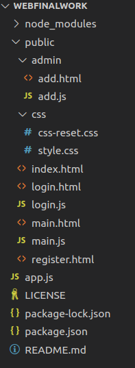

# 1.项目设计

### （1）项目构成：

由app.js文件，public下的html及其对应的js文件构成。

### （2）引入

主要引用了express，mongoose，以及seesion，其中express实现页面各项功能的处理，mongoose连接mongodb数据库，seesion记录用户的登录数据

### （3）各部分说明

app.js文件为主要内容的存放与实现

public下存放网页与其所用的javascript文件，admin文件夹下存放管理员才具有操作权限的网页及js文件

index.html：主页	main.html：查看搜索图书界面	login.html：登录页面	register.html：注册页面

add.html：增加图书页面

# 2.使用说明书

（1）运行app.js文件，进入10232端口

（2）点击主页右上方登录输入admin admin登录或者在登录页面点击注册按钮前往注册

（3）登录成功后进入图书查看页面，可以查看并根据完整书名查找图书

（4）管理员用户可进入图书添加页面，输入图书信息点击添加按钮添加图书

# 开发日志

1.新建项目，初始化nodejs和mongodb

2.安装express，mongoose，ejs，加入index

3.添加网页，实现注册

4.实现登录，上传session

5.实现显示mongodb数据到网页中，添加图书功能

6.非管理员不能添加图书，增加登出功能

7.实现搜索，加了一些限制，调整html页面

8.文档的完善